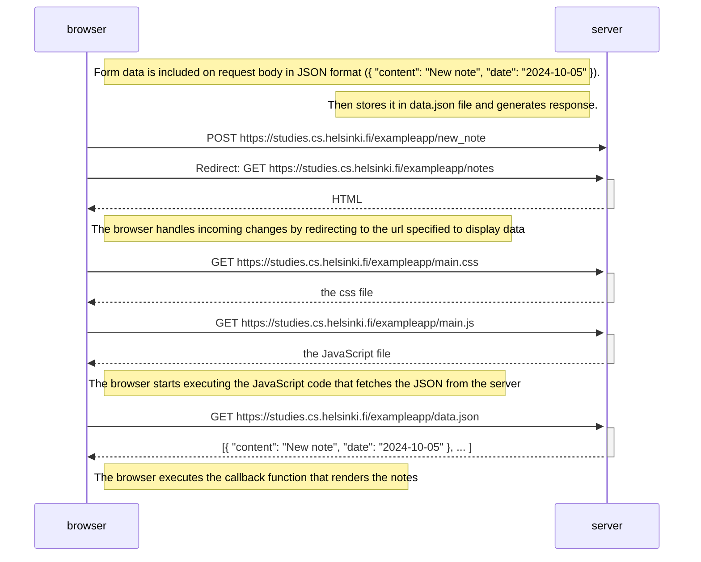

```mermaid
sequenceDiagram
    participant browser
    participant server

Note left of server: Form data is included on request body in JSON format ({ "content": "New note", "date": "2024-10-05" }).
Note left of server: Then stores it in data.json file and generates response.


    browser->>server: POST https://studies.cs.helsinki.fi/exampleapp/new_note
    activate server
    browser->>server: Redirect: GET https://studies.cs.helsinki.fi/exampleapp/notes
    activate server
    server-->>browser: HTML
    deactivate server

Note right of browser: The browser handles incoming changes by redirecting to the url specified to display data

    

    browser->>server: GET https://studies.cs.helsinki.fi/exampleapp/main.css
    activate server
    server-->>browser: the css file
    deactivate server

    browser->>server: GET https://studies.cs.helsinki.fi/exampleapp/main.js
    activate server
    server-->>browser: the JavaScript file
    deactivate server

    Note right of browser: The browser starts executing the JavaScript code that fetches the JSON from the server

    browser->>server: GET https://studies.cs.helsinki.fi/exampleapp/data.json
    activate server
    server-->>browser: [{ "content": "New note", "date": "2024-10-05" }, ... ]
    deactivate server

    Note right of browser: The browser executes the callback function that renders the notes
```
