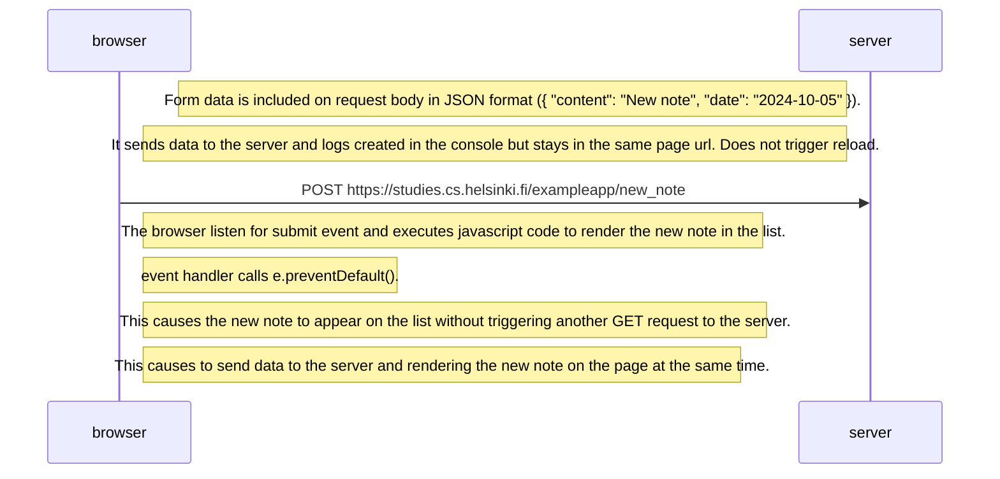

```mermaid
sequenceDiagram
    participant browser
    participant server

Note left of server: Form data is included on request body in JSON format ({ "content": "New note", "date": "2024-10-05" }).
Note left of server: It sends data to the server and logs created in the console but stays in the same page url. Does not trigger reload.


    browser->>server: POST https://studies.cs.helsinki.fi/exampleapp/new_note
    activate server

Note right of browser: The browser listen for submit event and executes javascript code to render the new note in the list.
Note right of browser: event handler calls e.preventDefault().
Note right of browser: This causes the new note to appear on the list without triggering another GET request to the server.
Note right of browser: This causes to send data to the server and rendering the new note on the page at the same time.


  
```
